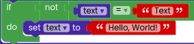
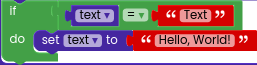
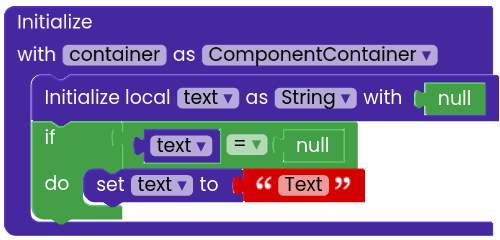
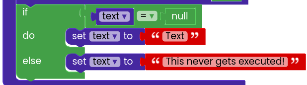

# Logic
Logic blocks are generally used control conditional if/then blocks and repeat blocks.
  

However, they are not just limited to conditional checks, i.e. in Rapid, the Logic section also provides access to the
commonly used Java keywords such as `null` and `this`.

### Inverse Operator (not)

- As the name suggests, the inverse operator `not` is used to reverse the conditions.
- `true` would turn to `false` and `false` would turn to `true` 

### Logical Operators

Logical operators are used to compare two or more values.
<code>=</code>, <code>not =</code>, <code>above or equal</code>, <code>below or equal</code> are some operators.

:::info To change the logical operator

- Drag a logical operator block from `logic` section
- Click on the operator symbol or the drop-down menu and select an option.

:::

### Logical: And

The logical expression `and` is used to assert that the conditions are `true`.
Even if any one turns `false`, the entire result is `false`.

If the first condition turns `false`, the other conditions will not be checked.

### Conditional check: If

If-else conditions in programming languages are used to stop the dataflow.
`if` consists of two things, i.e. the `conditional expression` and the `body`. The `conditional expression` is evaluated, if it turns out to be true, the `body` gets executed, or the `else body` if false.

In the image above, the `text = null` is the boolean condition and the `set text = "Text"` is considered as a body.

### Conditional check: if-else

Just like how if the `conditional expression` is true, the body gets executed, similarly, if it turns out false, the `else body` gets executed if it's present.

:::info Adding else condition
- Drag an if block from `logic` section
- Click on the add (+) icon
:::

### Keywords

- `null` and `this`  are the keywords present in Java and thus in Rapid.
  
- `null` denotes nothing, not an empty string nor a number. [Read more - Java point](https://www.javatpoint.com/null-keyword-in-java)
- `this` represents the current class/extension instance  [Read more - Java point](https://www.javatpoint.com/this-keyword)
