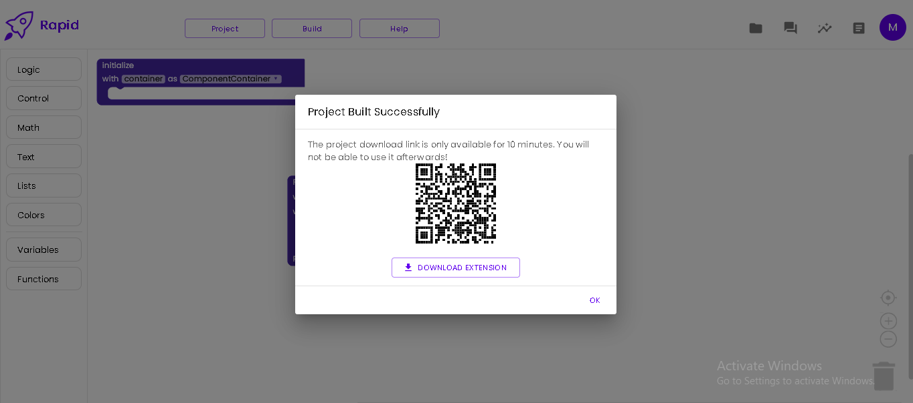
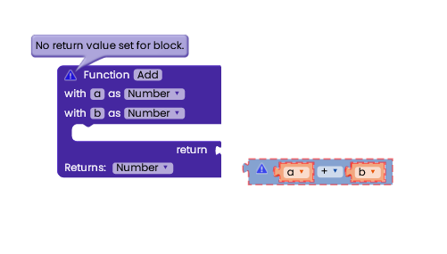
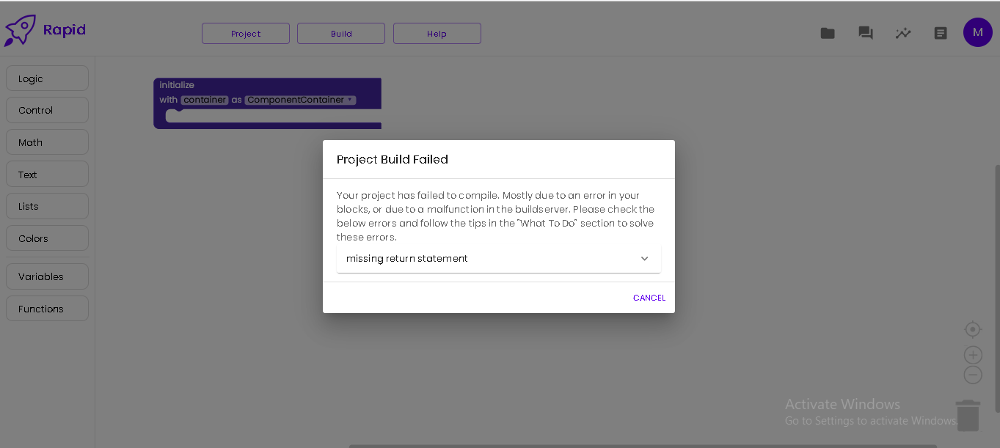
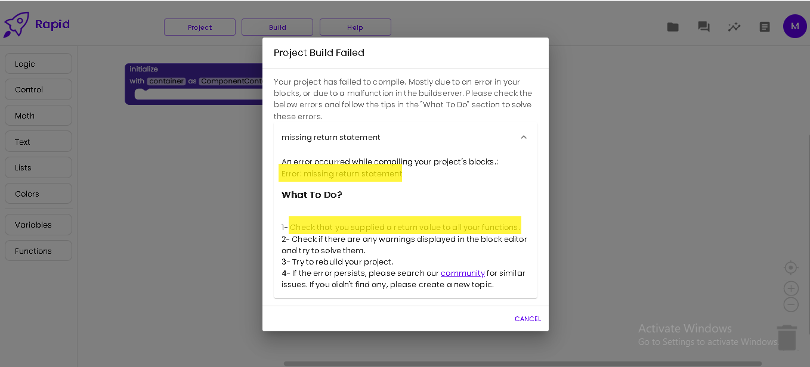

# Building Projects

Rapid includes an online extension compiler which compiles your blocks into the final .aix extension file which could be imported on AI2 or any of its distributions.

## Build your Project

Build your project by Clicking the 'Build' menu and selecting either:
- Build Project (Debug)
Creates a debug version of your extension. Debug builds aren't proguarded.
- Build Project (Release)
Creates a release version of your extension. You should build the extensions that you would publish publicly using this option. The extension would be proguarded (if enabled) and the version number will be bumped (if enabled)

A loading screen would show having the 'Building Project' message and the build stage and percentage underneath. A small extension would noramlly take 1-10 seconds for compilation depending on the server load. Larger extensions would take more time depending on the number of blocks and the size of the libraries used.

After the compilation finishes successfully you will be prompted to download the extension file either by clicking the download button or scanning the QR code.

## Dealing with compile errors

In most scenarios, the extension would compile successfully without errors. But sometimes, you have an error in your blocks or the buildserver malfunctions which results in a *compile error*.

Compile Errors are error messages returned by Rapid's buildserver on failure to compile a project.

For example considering these blocks (notice that the function's return blocks is incorrectly unplaced)

If you try to compile such blocks. The compilation would end up with a compile error.

To view the full error click the ▼ icon. Errors mostly consist of two parts.
- The error message
The compile error which was returned by the compiler.
- What To Do?
Since errors aren't most likely to be friendly to a block programmer. So the 'what to do section' provides some helpful advices for the possible cause of the error and how could you solve it.

In most cases, all what you need to do is to follow the advices of the What To Section. If nothing works, please search the [community](https://community.rapidbuilder.tech) for existing similar issues or create a new issue.

:::danger The most common reasons of compile errors are:
- Leaving some blocks' slots empty.
- Forgetting to return a value from a block that expects a return value
- Returning a value that doesn't match the return type of the function (ex.: returning a string from a function with return type: Number) or setting a variable to a value with a type different from the one you initialized the variable with ( setting a number variable to a list ).
- Uploading a corrupted library file.
:::
