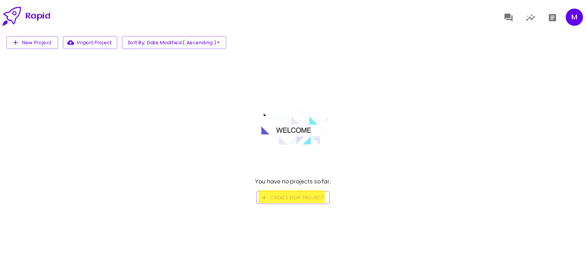
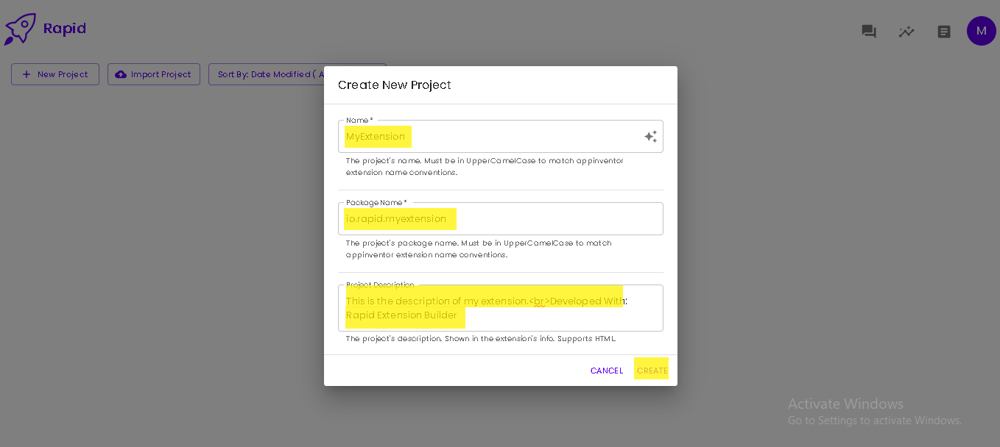

# Create a Project

Projects are a group of blocks that are compiled by the Rapid Buildserver into an extension (.aix). The extension for project files is .rbx (Rapid Builder Extension)

## Create your first Project

## Creating a New Project

Create a new project by entering the [main page of Rapid](https://create.rapidbuilder.tech) and clicking the 'Create New Project' button.

You will be prompted to enter three basic information about your extension:
- **Extension's name**: The name of your extension. It's preferred to be in UpperCamelCase (ex.: TestExtension) and not test_extension or testExtension. This property is unchangeable after the creation of your project.
- **Package Name**: This is the unique identifier of your extension that identifies it among other extensions. Package names are written as: domain.company.project (ex.: tech.rapidbuilder.extension). They are preferably written in all lower case (ex.: io.rapid.extension) and not: (io.Rapid.Extension). This property is unchangeable after the creation of your project.
- **Description**: Describe in this property the usage of your extension, how it works, support links, the name of the extension developer, etc.. This is an optional property. You could leave it empty, and you would be able to modify it later. HTML is supported in project descriptions. So you could write (ex.: "&lt;b>Bold Text&lt;/b> or &lt;i>italic text&lt;/i> &lt;br>New Line" would display as:
  <b>Bold Text</b> or <i>italic text</i>
  New Line)

After filling the above information about your project. Click the 'Create' button. The project would be automatically created and opened.
