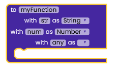
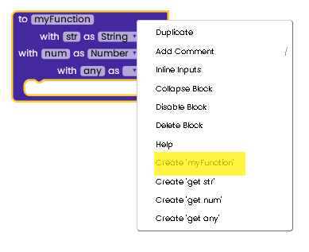
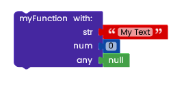
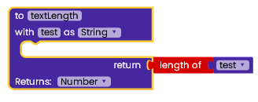
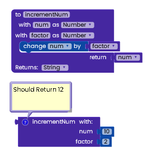
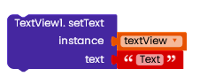
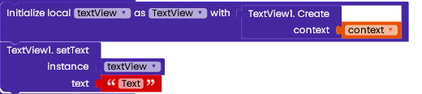
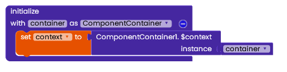
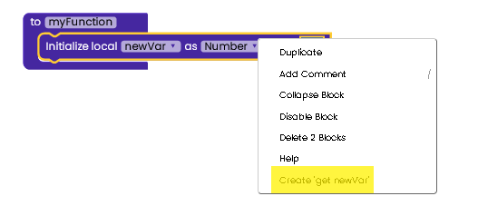
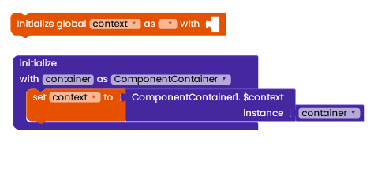

# Extension Development Concepts

:::info
This guide is very important as it contains the most basic extension development fundamentals that you would need throughout your journey in developing extensions with Rapid.
:::

## Functions
Functions are just like AI2 procedures. They are called in another place in the blocks, they could be provided with parameters, and they could return a result.
You could define a function as follows:

You could require callers to pass some parameters when calling the function as well by adding parameters using the blue add icon beside the function name:

To create a caller for the function:

The caller would display as follows:

:::tip
The 'null' block means nothing. It could be found in the 'Logic' category.
:::

Functions could also return a value. For example, this function returns the length of the text passed:

Here's a complete example of functions. This block will increment the 'number' parameter by the 'factor' variable provided:

Functions could also be provided by [classes](classes). When importing a class all the callers of the functions that are present in the class are displayed in the class category in the toolbox. They could be called just like the functions above.

When a function contains an instance parameter like the above one. It's called an instance function/method which means that we are required to create an instance of the class first using a constructor to be able to access the method. This is briefly explained in the following constructors' section.
Functions that don't contain an instance parameter are called *static functions/methods*. They could be called directly without creating the class previously.

## Constructors
Constructors are used to creating an instance of/instantiate a [class](classes) where it's provided with some arguments or even no arguments and returns an *instance* of that class. Classes must be constructed to be able to access most functions in it through the instance returned by the constructors.
Constructors are called **Create** blocks in Rapid. They display as follows:

Constructors' results could be stored in a variable, so they could be used later in an instance parameter. For example:

In that case, the textView variable contains the instance returned by the constructor.

## The Initialize Function

The initialize function is present in every extension and is un-deletable. It's called as soon as the extension is created. You could use it to get the component container instance of the extension (from the container argument) and run blocks when the extension starts (ex.: initialize variables, call functions, get context, etc..)

## Variables
Variables are used to store values and access them later, either globally (anywhere from your blocks) or locally (could only be accessed through a specific function where the variable was initialized into)

To define a global variable, place it anywhere in the block editor:

You could leave the type empty, and it would be considered as Any (Object), or leave the default value as empty, and it would be considered as nothing (null)

To initialize a local variable just place it in the function you want to access the variable in. It would automatically change its color to the function color and change from global to local variable.

To access the variable's value, right-click on the initialize variable block and choose 'get varName' option from the menu:

or drag the 'get varName' block from the variables' category.

To change the variable value drag the 'set varName' block from the variables' category:

## Context
It's the context of the current state of the application/object. It lets newly-created objects understand what has been going on. Typically, you call it to get information regarding another part of your program (activity and package/application). From [StackOverFlow Answer](https://stackoverflow.com/a/3572553).

It's most commonly used to create new objects such as views (as explained later in the Views section). Using Android various classes, you will need to pass the context of your extension to use many functions.

To get the component context:

1- Import The `ComponentContainer` class. The component container class is the container that holds the current extension, and it's helpful to get some basic information about the extension container such as the context and Form (a.k.a: Screen). To import classes check this [guide](classes).

2- Drag the ComponentContainer1.$context function from the component container category.

3- Drag 'initialize global variable' to the blockly editor and name it as context

4- From the variables' category, drag the 'set context to' block and place it in 'initialize' block

5- Connect the ComponentContainer1.$context function to 'set context to' block

6- Set the instance parameter to the container argument in the initialize function
That's it. The final blocks should be like this:

## Views
A view is a simple building block occupying a rectangular box of the app's user interface. All AI2 interface components use views to display different interfaces on the screen (ex.: buttons, labels, and images) as well as any UI extension.

There are a lot of views available in android such as: TextView (label), ImageView (image), EditText (textbox), etc..

To include a view in your app, take the view's name (Ex.: TextView) and import it as explained in this [guide](classes).

After importing the view, you would need to use constructors. The most widely used constructor that's used for creating classes in AI2 extension is the following:

To get the context to pass to the Create function of the view. Check the Context section above.
