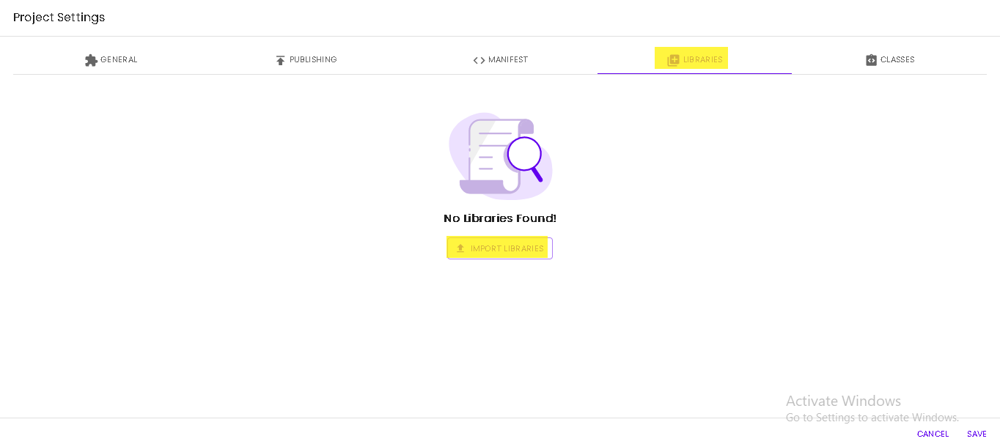

# Libraries

Libraries are .JAR package files that contain a group of class files and their associated metadata and resources (such as text, images, etc..)

Libraries are supported in Rapid and they are used to include new classes that aren't available in the Andorid/AppInventor/Java APIs.

## Import Your First Library
Rapid makes it easy to import the library you want. You would need to import the .JAR file and all the classes that .JAR contains will be available to import by following the [Importing Classes Guide](classes)

To import a library, click the Project menu, and choose the 'Options' menu item. Afterwards, select the 'Libraries' tab.

Click the 'Import Library' button and upload the JAR file or drag and drop it to the import dialog. Then, click Import.
Done! You have imported your library to the project!
