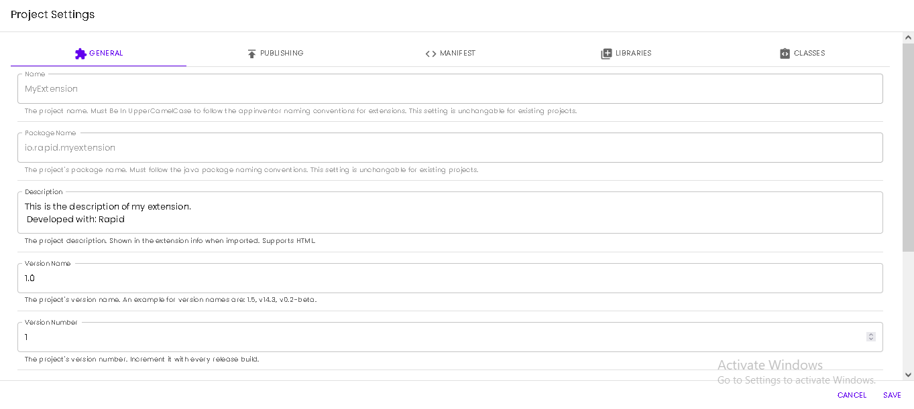

# Project Options

Rapid includes some options to modify the information of your extension.

## General Options
The basic metadata of your extension.

### Name & Package Name
The name and the package name are the unique identifiers of your project. They are unchangeable after the project creation.
### Description

The description of your extension shown when clicking the info icon of your extension in AI2 or any of its distributions.

### Version Name

The extension's version name is the text representation of the version. For example: 1.0, 2.5.4, 0.3.6-beta, etc..

### Version Number

The extension's version number is a number variation of the extensions' version. It should be incremented every release build (either manually or by enabling the Auto Increment Version in Publishing tab)

### Home Website

The project's home website property links to the extension's website. Leave it empty or add a valid URL to your extension's website

### Min SDK
The minimum android SDK the extension could run on. You should normally leave this property as its default unless you are using a feature that isn't available before a specific android version (ex.: using a function that was added in android 21, and subsequently it won't work on previous android versions. So you set this property to android 21). When the extension is added to an app. The app wouldn't work on earlier android version than specified unless another extension or component declares a higher version than the one your extension declares.

### Project Icon
The icon of your project. Defaults to rapid's default logo. It's saved under the aiwebres/ directory in your project file (.rbx)
## Publishing

The publishing tab contains some properties that's useful when building a [release build](build-your-project.md)

### Proguard Extension
Proguard protects your extension code by obfuscating and optimizing the generated code to be more secure. This is only effective when creating a [release build](build-your-project.md).
### AutoIncrement Version
Auto-Increments the extension version number. This is only effective when creating a [release build](build-your-project.md).
